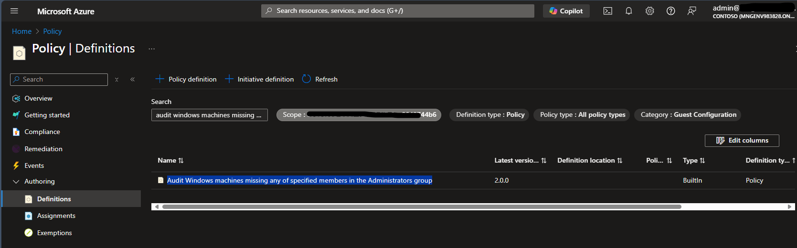
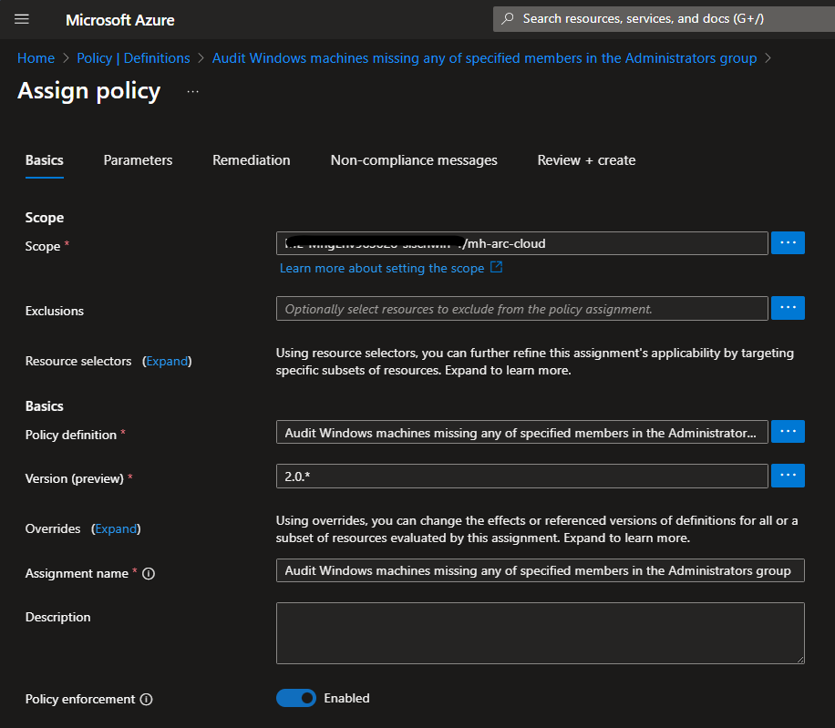
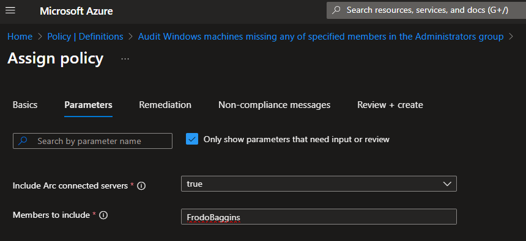

# guest-configuration-demo

## Assign a built-in Azure Guest Configuration Policy to your arc-enabled VM

As a demo we are using the built-in Guest Configuration Policy 'Audit Windows machines missing any of specified members in the Administrators group' to automatically add the user 'FrodoBaggins' to the local administrators group.

1. In the Azure Portal navigate to Policy. In section Authoring select Definitions. 
2. Set the scope to the tenant root group.

3. Optionally, filter for Category == Guest Configuration
4. Search for 'Audit Windows machines missing any of specified members in the Administrators group'
5. Click the name of the policy and then Assign policy

6. Change the scope to the resource group where your arc-enabled VM is located
7. In Parameters tab check the box 'Include Arc connected servers' and type 'FrodoBaggins' in the 'Members to include' field.

8. In Remediation tab check the box 'Create a Managed Identity'
9. Click Review and Create and then Assign

## Create a custom Guest Configuration Policy and assign it
Now that the policy definition is created you can assign the policy:
